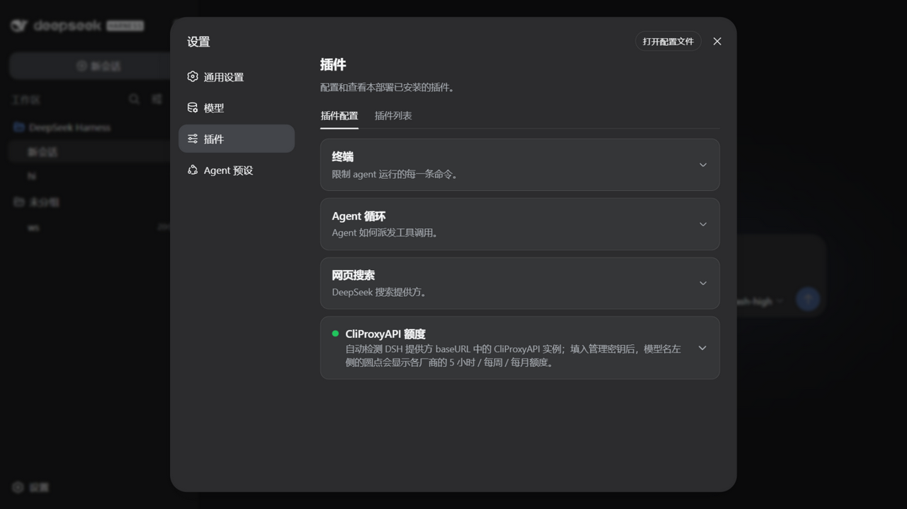
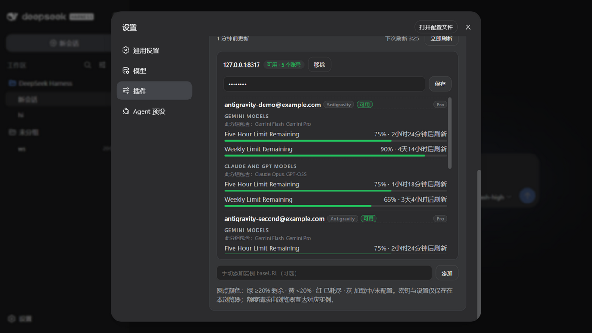
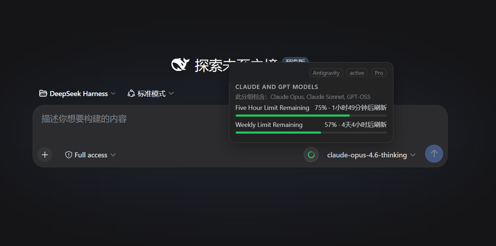

# dsh-client-ui-cpa-quota

[](https://github.com/wkscc310/dsh-client-ui-cpa-quota)
[](LICENSE)
[](https://github.com/wkscc310/dsh-client-ui-cpa-quota/actions/workflows/ci.yml)
[](https://github.com/deepseek-ai/deepseek-harness)

English | [中文](README.zh.md)

A [DSH (DeepSeek Harness)](https://github.com/deepseek-ai/deepseek-harness) Web UI plugin that shows [CLIProxyAPI](https://github.com/router-for-me/CLIProxyAPI) quota right where you look: a native-styled ring beside the model picker, a health dot on the settings card, and a CPA-management-style panel listing **every account's quota windows** in one place.

- Zero dependencies, plain JavaScript, no build step.
- Instances are discovered automatically from your DSH provider `baseURL`s — no model lists, no config file required.
- Everything runs browser-side; your management keys never leave this browser's `localStorage`.

## Screenshots

### Collapsed card with quota health dot

The settings card stays collapsed like the built-in ones. The dot condenses every instance's worst window: green = healthy, amber = a window under 20%, red = exhausted or a failed refresh, gray = waiting / no key.

<p align="center">
  
</p>

### All accounts, CPA-management style

Expand it and every account of every instance is listed with its subscription plan, provider badge, and all quota windows (5-hour / weekly / monthly) — not filtered by the current model. (Demo data from `tests/mock-cpa.mjs`.)

<p align="center">
  
</p>

### Ring beside the model picker

Hover the ring next to the selected model for matching accounts, providers, plans, windows, and reset times.

<p align="center">
  
</p>

## Features

- Reads models and `baseURL` values from DSH providers automatically; no model list to maintain.
- Fingerprints each `baseURL` as CLIProxyAPI and never leaves an empty ring on ordinary OpenAI-compatible endpoints.
- Supports multiple CLIProxyAPI instances and accounts, filtering the hover tooltip to the selected model while the settings panel always shows everything.
- Orders windows as `5-hour → weekly → monthly → daily`; the ring uses the first available window in that order.
- Queries Codex, Claude, Antigravity, Gemini CLI, Kimi, and xAI/Grok through their upstream quota APIs; other CPA providers still expose account status and recent activity.
- **In-use account detection**: CPA's per-request usage queue feeds a local 7-day ledger, so the tooltip shows the accounts actually serving the selected model in the last 24 hours (sorted by last use, with an "in use" badge and 24h request/token totals) and collapses the rest under "Other accounts".
- Account probes run through a bounded pool with a per-request timeout — one hung upstream can never stall the refresh cycle.
- Keeps the last successful snapshot across transient refresh failures and reuses rings across DSH screen remounts.
- Colors: green ≥20% remaining, amber <20%, red exhausted/error, gray loading or missing a management key.

## Requirements

- DSH **Web profile** on the current plugin contract (validated against `dsh` 0.1.1-rc.2); the plugin only registers in the Web UI.
- A reachable CLIProxyAPI instance with its management API enabled.
- Models must be routed through a DSH provider whose `baseURL` points at the corresponding CPA instance.
- A management key for each CPA instance. Keys entered in the settings card stay in the current browser's `localStorage`; YAML-managed keys remain in the YAML file.

## Quick install

The plugin declares a `dsh.bundle` manifest and is published to npm, so one command installs **and** activates it — no config editing, no git, no build:

```sh
dsh plugin --profile web add dsh-client-ui-cpa-quota
```

Prefer the installer? It also handles networks where GitHub is flaky, falls back to copying when pnpm is unavailable, and migrates older installs:

### Windows PowerShell

```powershell
$p=Join-Path $env:TEMP 'dsh-cpa-install.ps1'; Invoke-WebRequest -UseBasicParsing -Uri 'https://raw.githubusercontent.com/wkscc310/dsh-client-ui-cpa-quota/main/install.ps1' -OutFile $p; powershell -NoProfile -ExecutionPolicy Bypass -File $p
```

### macOS / Linux

```sh
curl -fsSL https://raw.githubusercontent.com/wkscc310/dsh-client-ui-cpa-quota/main/install.sh -o /tmp/dsh-cpa-install.sh && sh /tmp/dsh-cpa-install.sh
```

Restart the DSH Web host, then open:

```text
Settings → Plugins → CliProxyAPI Quota
```

Expand the card, paste the management key for each instance, and reopen the model picker.

> After updates, just run the same `dsh plugin add` (or the installer) again and restart the host.

## Manual install

### macOS / Linux

```sh
git clone https://github.com/wkscc310/dsh-client-ui-cpa-quota.git "$HOME/.dsh/plugins/dsh-client-ui-cpa-quota"
dsh plugin --profile web add "$HOME/.dsh/plugins/dsh-client-ui-cpa-quota"
```

### Windows PowerShell

```powershell
git clone https://github.com/wkscc310/dsh-client-ui-cpa-quota.git "$env:USERPROFILE\.dsh\plugins\dsh-client-ui-cpa-quota"
dsh plugin --profile web add "$env:USERPROFILE\.dsh\plugins\dsh-client-ui-cpa-quota"
```

Without the `dsh` CLI (or without pnpm), copy the plugin into the profile's `node_modules` instead — a symlink will not work, because Node resolves imports from the link target's real path:

```sh
mkdir -p "$HOME/.dsh/profiles/web/node_modules"
cp -R "$HOME/.dsh/plugins/dsh-client-ui-cpa-quota" "$HOME/.dsh/profiles/web/node_modules/"
```

A copy install does not activate the bundle layer, so the loader entry must be added by hand to `~/.dsh/profiles/web/cordis.patch.yml` (Windows: `%USERPROFILE%\.dsh\profiles\web\cordis.patch.yml`). If the file still contains the fresh-profile placeholder `[]`, replace it with the entry:

```yaml
- insert:
    - id: ui-cpa-quota
      name: dsh-client-ui-cpa-quota
```

## Optional configuration

Auto-discovery is usually enough. To pin instances or keep management keys in YAML:

```yaml
- insert:
    - id: ui-cpa-quota
      name: dsh-client-ui-cpa-quota
      config:
        refreshMinutes: 5
        instances:
          - baseURL: https://your-cpa.example
            managementKey: your-management-key
          - baseURL: https://another-cpa.example/v1
            managementKey: another-management-key
```

The browser settings card overrides YAML. `refreshMinutes` is clamped to at least one minute; do not commit management keys to a public repository.

## Supported quota sources

| Provider | Upstream source | Typical windows |
| --- | --- | --- |
| Codex / OpenAI | `wham/usage` | 5-hour, weekly, or monthly |
| Claude | OAuth usage/profile | weekly, monthly |
| Antigravity | `retrieveUserQuotaSummary`, falling back to `fetchAvailableModels` | 5-hour, weekly, monthly |
| Gemini CLI | Google quota endpoint | 5-hour, weekly, daily |
| Kimi | `/coding/v1/usages` | provider-defined |
| xAI / Grok | billing, with a paid-account health fallback | weekly, monthly |
| Other CPA providers | auth-file status and recent activity | provider-defined |

## How detection works

1. The plugin builds a model → `baseURL` index from DSH `llm.providers` and `settings.describe`, normalizing away the protocol, `www.`, and a trailing `/v1`.
2. It requests `<baseURL>/v0/management/usage-statistics-enabled` for each provider base.
3. A 401 containing `management`/`unauthorized`, or a CPA-shaped 2xx, identifies CLIProxyAPI. Typical 404s, other responses, and network failures are not added as quota instances.
4. Verdicts are cached in the browser for one hour; **Refresh now** re-fingerprints immediately, so a newly added CPA instance shows up without waiting.

That is why a model using an ordinary OpenAI-compatible baseURL has no empty ring. An auto-detected CPA without a management key gets a gray ring and a settings hint.

## Development

Plain JavaScript, no build step.

```sh
node --check lib/client.js && node --check lib/index.js
node tests/smoke.mjs        # full logic + settings-card render harness
node tests/mock-cpa.mjs     # optional: a fake CPA on http://127.0.0.1:8317 (key: mock-key)
```

Point the plugin's manual instance input at the mock to see a full five-account demo without a real CPA. CI runs the syntax checks and the smoke test on Ubuntu and Windows for every push and pull request.

## FAQ

- **No ring?** The selected model's DSH provider `baseURL` must point at CLIProxyAPI rather than an upstream official API, and the management API must be enabled. The ring is per model — switch models and it follows.
- **Gray ring?** Paste the instance's management key under **Settings → Plugins → CliProxyAPI Quota**.
- **Just added a CPA instance and nothing shows up?** Hit **Refresh now** in the card — it re-fingerprints every provider base immediately instead of waiting out the one-hour probe cache.
- **Stale numbers?** Numbers refresh on the configured interval; a failed refresh keeps the last good snapshot and says so on the card.
- **Where are my keys stored?** In this browser's `localStorage` only. Quota requests go straight from the browser to each instance; the DSH host never sees your keys.
- **Switching browsers?** Use **Export config / Import config** on the card to move instances and keys between browsers. The exported JSON is plaintext — store it carefully.
- **Tooltip shows every account?** The tooltip filters accounts by what each one actually serves, using CPA's own per-auth model registry first, then the model name and the DSH provider id as fallbacks. Only when a model matches no registry entry and no family signal can it be pinned down does the tooltip list the remaining usable accounts — and it says so when it does.
- **Tooltip shows fewer accounts than before?** The in-use filter is on by default: accounts that served the selected model in the last 24 hours are pinned with an "in use" badge, the rest collapse under "Other accounts". Turn off "只显示使用中的账号" on the card to see every candidate again.
- **"usage stats off" badge?** Enable usage statistics in your CPA config (`usage-statistics-enabled: true`) — the in-use detection reads CPA's per-request usage queue and needs that toggle on. Everything else works without it.

## Community

- Published & discussed on [LINUX DO](https://linux.do) — thanks to the community for the feedback.
- Listed on [awesome-dsh-plugin](https://github.com/awesome-dsh-plugin/awesome-dsh-plugin) (entry PR [#3852](https://github.com/awesome-dsh-plugin/awesome-dsh-plugin/pull/3852)); once merged, the plugin is installable from [dsh-market](https://github.com/dsh-market/dsh-market) inside DSH's settings.

## License

[MIT](LICENSE)
