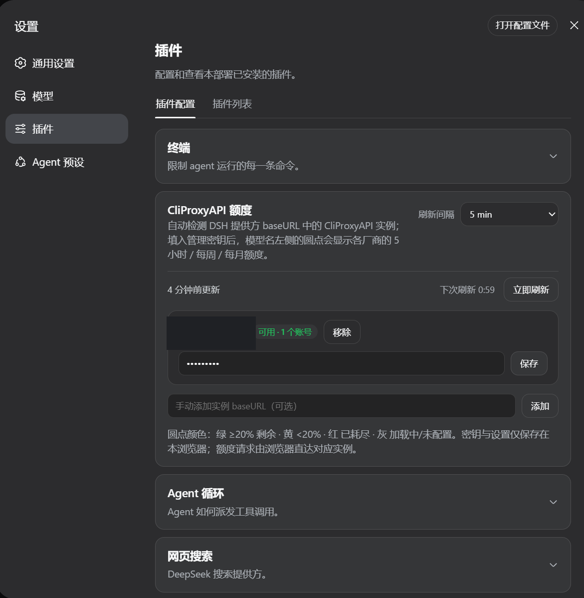

# dsh-client-ui-cpa-quota

[](https://github.com/wkscc310/dsh-client-ui-cpa-quota) [](LICENSE)

English | [中文](README.zh.md)

A [DSH (DeepSeek Harness)](https://github.com/deepseek-ai) Web UI plugin that displays [CLIProxyAPI](https://github.com/router-for-me/CLIProxyAPI) quota next to the model picker. It adds a native-looking 14px ring beside the model button; hover it to inspect matching accounts, providers, subscription plans, quota windows, and reset times.

## Screenshots

### Model quota tooltip

<p align="center">
  
</p>

### Plugin settings card

<p align="center">
  
</p>

## Features

- Reads models and `baseURL` values from DSH providers automatically; no model list to maintain.
- Fingerprints each `baseURL` as CLIProxyAPI and never leaves an empty ring on ordinary OpenAI-compatible endpoints.
- Supports multiple CLIProxyAPI instances and accounts, filtering the tooltip to the selected model.
- Orders windows as `5-hour → weekly → monthly → daily`; the ring uses the first available window in that order.
- Queries Codex, Claude, Antigravity, Gemini CLI, Kimi, and xAI/Grok through their upstream quota APIs; other CPA providers still expose account status and recent activity.
- Keeps the last successful snapshot across transient refresh failures and reuses rings across DSH screen remounts.
- Colors: green ≥20% remaining, amber <20%, red exhausted/error, gray loading or missing a management key.

## Requirements

- DSH **Web profile** (the plugin only registers in the Web UI).
- A reachable CLIProxyAPI instance with its management API enabled.
- Models must be routed through a DSH provider whose `baseURL` points at the corresponding CPA instance.
- A management key for each CPA instance. Keys entered in the settings card stay in the current browser's `localStorage`; YAML-managed keys remain in the YAML file.

## Quick install

The installer places the plugin under `~/.dsh/plugins`, links or copies it into the Web profile's `node_modules`, and appends the loader entry.

### Windows PowerShell

```powershell
$p=Join-Path $env:TEMP 'dsh-cpa-install.ps1'; Invoke-WebRequest -UseBasicParsing -Uri 'https://raw.githubusercontent.com/wkscc310/dsh-client-ui-cpa-quota/main/install.ps1' -OutFile $p; powershell -NoProfile -ExecutionPolicy Bypass -File $p
```

### macOS / Linux

```sh
curl -fsSL https://raw.githubusercontent.com/wkscc310/dsh-client-ui-cpa-quota/main/install.sh -o /tmp/dsh-cpa-install.sh && sh /tmp/dsh-cpa-install.sh
```

Restart the DSH Web host, then open:

```text
Settings → Plugins → CliProxyAPI Quota
```

Paste the management key for each instance and reopen the model picker.

> If Windows cannot create symlinks, the installer falls back to copying the plugin. Re-run the installer after updates when using copy mode.

## Manual install

### macOS / Linux

```sh
git clone https://github.com/wkscc310/dsh-client-ui-cpa-quota.git "$HOME/.dsh/plugins/dsh-client-ui-cpa-quota"
mkdir -p "$HOME/.dsh/profiles/node_modules"
ln -s "$HOME/.dsh/plugins/dsh-client-ui-cpa-quota" "$HOME/.dsh/profiles/node_modules/dsh-client-ui-cpa-quota"
```

### Windows PowerShell

```powershell
git clone https://github.com/wkscc310/dsh-client-ui-cpa-quota.git "$env:USERPROFILE\.dsh\plugins\dsh-client-ui-cpa-quota"
New-Item -ItemType Directory -Force "$env:USERPROFILE\.dsh\profiles\node_modules" | Out-Null
New-Item -ItemType SymbolicLink -Path "$env:USERPROFILE\.dsh\profiles\node_modules\dsh-client-ui-cpa-quota" -Target "$env:USERPROFILE\.dsh\plugins\dsh-client-ui-cpa-quota"
```

Add the loader entry to `~/.dsh/profiles/web/cordis.patch.yml` (Windows: `%USERPROFILE%\.dsh\profiles\web\cordis.patch.yml`):

```yaml
- insert:
    - id: ui-cpa-quota
      name: dsh-client-ui-cpa-quota
```

## Optional configuration

Auto-discovery is usually enough. To pin instances or keep management keys in YAML:

```yaml
- insert:
    - id: ui-cpa-quota
      name: dsh-client-ui-cpa-quota
      config:
        refreshMinutes: 5
        instances:
          - baseURL: https://your-cpa.example
            managementKey: your-management-key
          - baseURL: https://another-cpa.example/v1
            managementKey: another-management-key
```

The browser settings card overrides YAML. `refreshMinutes` is clamped to at least one minute; do not commit management keys to a public repository.

## Supported quota sources

| Provider | Upstream source | Typical windows |
| --- | --- | --- |
| Codex / OpenAI | `wham/usage` | 5-hour, weekly, or monthly |
| Claude | OAuth usage/profile | weekly, monthly |
| Antigravity | `retrieveUserQuotaSummary`, falling back to `fetchAvailableModels` | 5-hour, weekly, monthly |
| Gemini CLI | Google quota endpoint | 5-hour, weekly, daily |
| Kimi | `/coding/v1/usages` | provider-defined |
| xAI / Grok | billing, with a paid-account health fallback | weekly, monthly |
| Other CPA providers | auth-file status and recent activity | provider-defined |

## How detection works

1. The plugin builds a model → `baseURL` index from DSH `llm.providers` and `settings.describe`, normalizing away the protocol, `www.`, and a trailing `/v1`.
2. It requests `<baseURL>/v0/management/usage-statistics-enabled` for each provider base.
3. A 401 containing `management`/`unauthorized`, or a valid management response, identifies CLIProxyAPI. Typical 404s, other responses, and network failures are not added as quota instances.
4. Verdicts are cached in the browser for one hour. A ring is created only for a confirmed CPA base; after confirmation, the management key is used for `/v0/management/auth-files` and upstream quota calls.

That is why a model using an ordinary OpenAI-compatible baseURL has no empty ring. An auto-detected CPA without a management key gets a gray ring and a settings hint.

## Troubleshooting

- **No ring**: verify that the selected model's DSH provider `baseURL` points to CLIProxyAPI rather than an upstream official API, and that the management API is enabled.
- **Gray ring**: add the instance's management key under **Settings → Plugins → CliProxyAPI Quota**.
- **Old model/instance data**: restart the DSH Web host or use the refresh control; discovery verdicts are cached for up to one hour.
- **Updates do not appear after a copied install**: re-run the installer, or remove `~/.dsh/profiles/node_modules/dsh-client-ui-cpa-quota` and install again.

## Development

Plain JavaScript, no build step. After editing `lib/client.js`, run:

```sh
node --check lib/client.js
node tests/smoke.mjs
git diff --check
```

Issues and pull requests are welcome at [github.com/wkscc310/dsh-client-ui-cpa-quota](https://github.com/wkscc310/dsh-client-ui-cpa-quota).

## License

[MIT](LICENSE)
